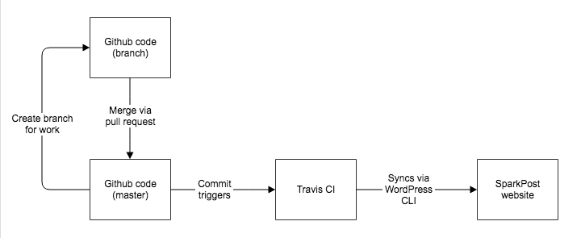

# SparkPost support docs
[](https://travis-ci.org/SparkPost/support-docs)
[](http://slack.sparkpost.com)

This repo contains the Markdown files for support articles published on https://www.sparkpost.com/docs.

## Managing articles

All support articles live in the `articles` folder. This folder has subfolders, one for each category (e.g. api, billing). The articles are formatted using [Markdown](https://daringfireball.net/projects/markdown/syntax). Each article contains a bit of YAML metadata at the top you can use to set the title and description:

```yaml
title: "Example Support Article"
description: "Lorem ipsum dolor sit amet, consectetur adipisicing elit, sed do eiusmod tempor incididunt ut labore et dolore magna aliqua. Ut enim ad minim veniam, quis nostrud exercitation ullamco laboris nisi ut aliquip ex ea commodo consequat."
```

The rest of the article content is written in plain Markdown, a simple syntax that can be used to write content for the web. A [Markdown tutorial](http://www.markdowntutorial.com/) is available on Github.

### How URLs are constructed

The URL for each article is constructed based off the folders and filenames. The name of the folder is the category and the name of the file is the slug. For example, given the following structure:

```
articles/integrations
├── using-sparkpost-heroku-add-on.md
└── using-templates-sparkpost-wordpress.md
```

You would have two articles published to the SparkPost website:

* https://www.sparkpost.com/docs/integrations/using-sparkpost-heroku-add-on
* https://www.sparkpost.com/docs/integrations/using-templates-sparkpost-wordpress

### Managing media

Media should be placed in `articles/<category>/media/<slug>/`, where `category` is the name of the folder containing the article and `slug` is the name of the file without the `.md` extension. For example, the following structure shows an article in the category `api` with some media:

```
articles/api
├── media
│   └── managing-sending-domains
│       └── some-image.png
├── index.md
└── managing-sending-domains.md
```

Note how the name of the file without the `.md` extension is same as the name of the subfolder in the `media` folder.

The file `managing-sending-domains.md` would then contain some Markdown like this:

```markdown
...


...
```

### Deployment pipeline



Deployment of support articles is handled automatically through [Travis CI](https://travis-ci.org/SparkPost/support-docs). Once code is merged down to the master branch, a build/deployment are triggered. The following occurs during this automated process:

* Categories for the articles are synced with WordPress
* Articles are converted from Markdown to HTML
* Articles and their images are synced with WordPress

### Making changes

See [CONTRIBUTING.md](.github/CONTRIBUTING.md)


## Development

Local development consists of the process of exporting data from Desk.com and importing it into a local WordPress instance.

### Install required libraries

Run the following command to install the [Wordpress CLI](http://wp-cli.org/), [jq](https://stedolan.github.io/jq/), and NPM dependencies. Note the script is written to work on Macs only.

```bash
./bin/bootstrap.sh
```

### Exporting from Desk

Previously the SparkPost Support articles were hosted on Desk.com.

Set the desk.com credentials to export the data:

```bash
export DESK_USERNAME=desk_email@domain.com
export DESK_PASSWORD=desk_password
```

To export from desk run `npm run live`. To test this with pre-downloaded data run `npm run local`. At last run there are 25 topics which will be saved to the `/articles` folder.

Each topic will be its own folder with an `index.md` file that defines the metadata about the topic pulled from desk. Each markdown file (other then `index.md`) is an article pulled from desk.com. The related media is stored in `/media` folder in the the folder with the corresponding name.


### Importing to WordPress

To run the import locally you'll need to define a couple of environment variables. You can use the below values as a template:

```bash
export WP_DEVELOPMENT="/my_wp/path" # This needs to be set to the absolute path to the wordpress core directory
export WP_USER="my.account@example.com" # Defaults to the Wordpress Support account
```

Run the `deploy-categories.sh` script followed by the `deploy-articles.sh` script.

```bash
./bin/deploy-categories.sh && ./bin/deploy-articles.sh
```

If you want to clear out the articles, categories, and related media imported support you can run the following magic.

```bash
./bin/clear-data.sh
```

To reimport everything use the `--all` flag on the each of the deploy scripts.
