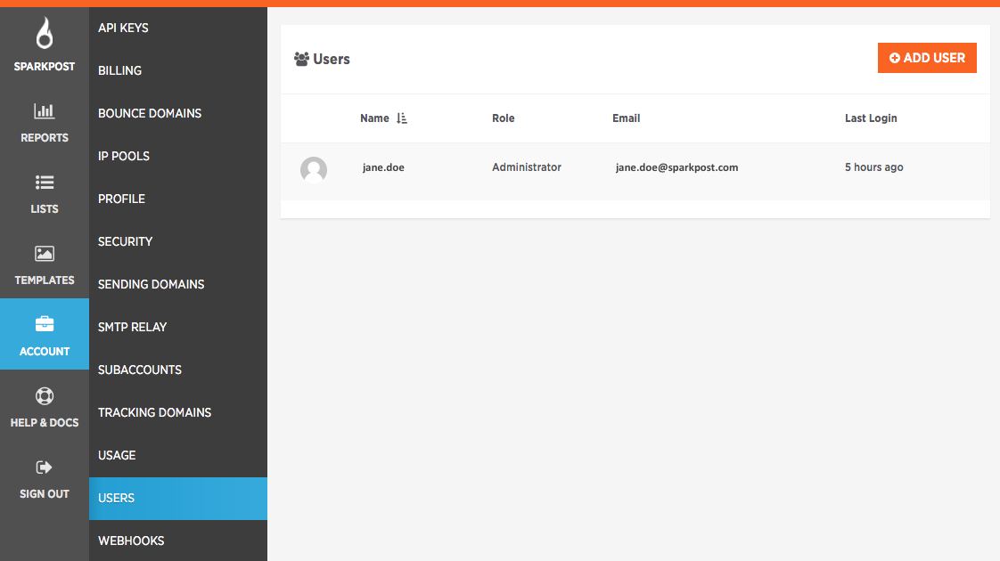
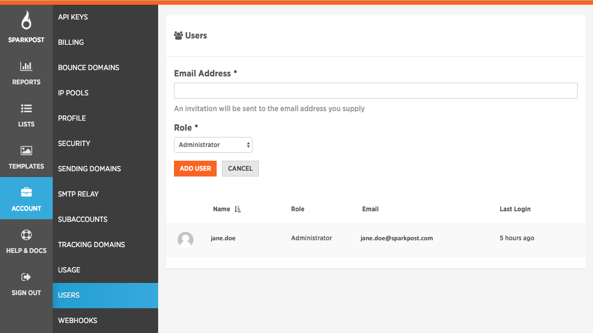
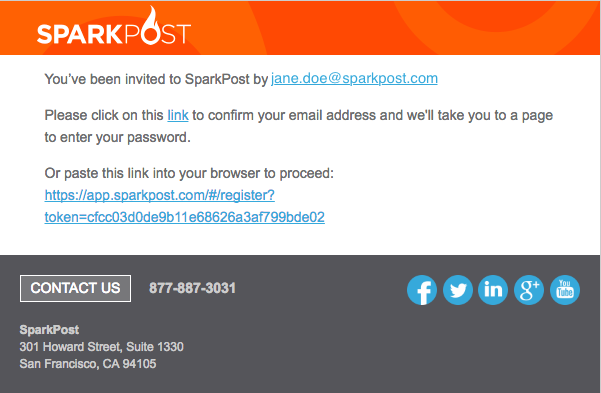
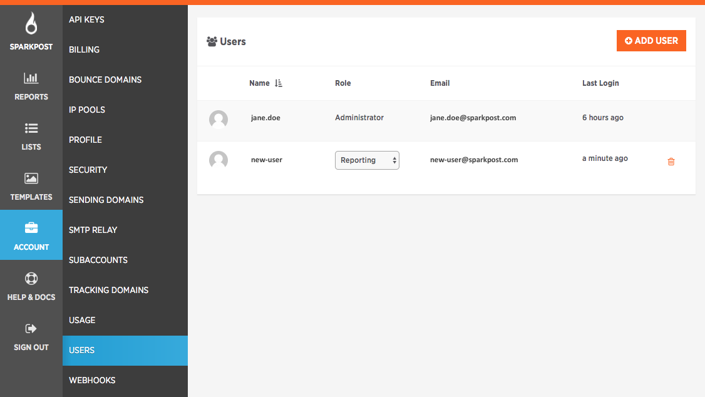
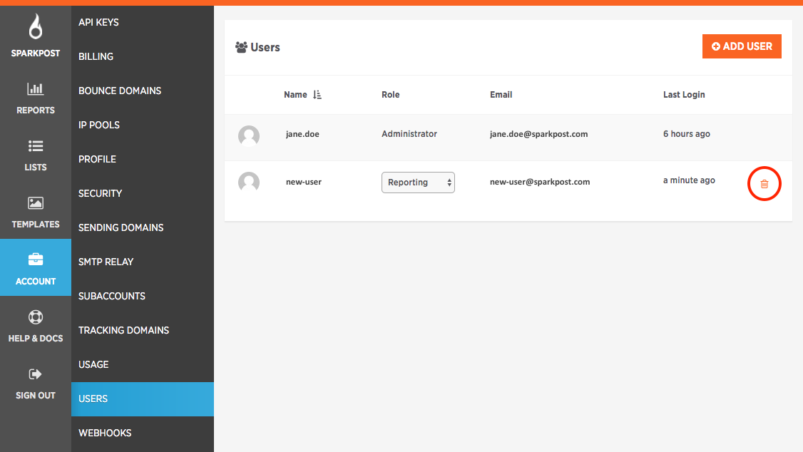
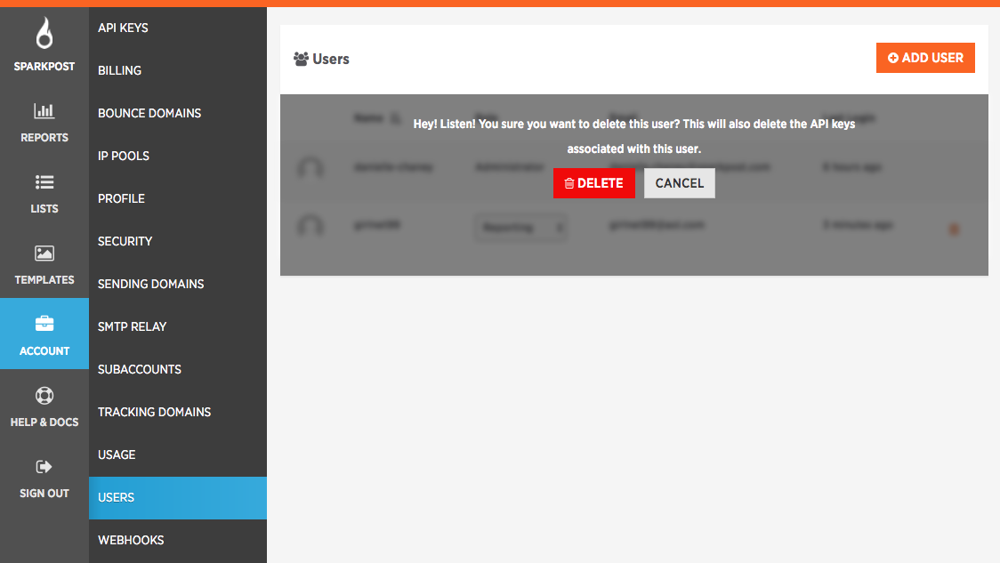
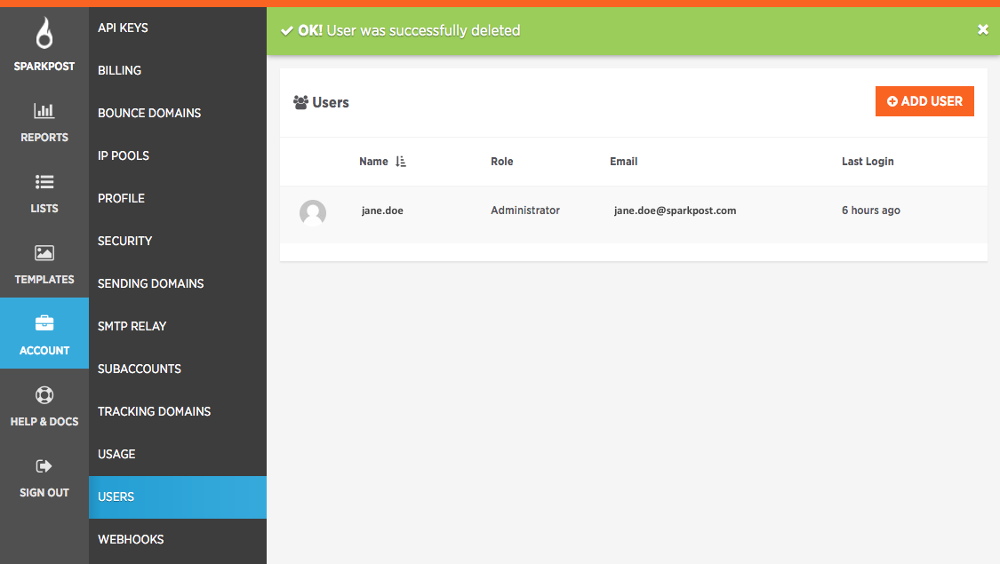

SparkPost and SparkPost Elite provide the ability to add or delete an additional user(s) to your account. This self-service feature is available via the user interface in the Account > Users section of the UI.  Moreover, there are also two role-based features available in the Web UI and they are: Admin and Reporting.

**Admin Role**     : Has access to all functionality in the UI and the ability to add additional administrators and create / invite users with a role of Reporting.

**Reporting Role**     : Can view all reports.  The Reporting user can see a summary of templates and they can also view individual templates, however they are not able to change them at this time.  The Reporting Role also has access to their Profile screen and can change their password (Note: Refer to the screen below).  Otherwise, this role does not have access to any other functionality in the UI.

 ### Adding a User to your Account 

The administrative user can invite colleagues to their account by completing the following steps:

1.  Click on the Add User button from the Account > Users screen. (Note: In the upper right hand corner of the screen).

    

2.  Add the Email Address of the prospective user in the Email Address field. 
3.  Select Reporting from the Role drop down menu (Note: In a similar fashion you can add an administrator to your account).
4.  Click the Add User button to continue.

    

5.  This screen confirms that the invitation has been sent to the prospective user.

    

6.  The prospective user will receive a request similar to the email below.

    

**Note**: The New User will be sent an invitation email to confirm acceptance.  Once they confirm, they will be added in as a new user (Admin/reporting) in the UI.   They MUST complete this step before they will be granted access to the UI in this role.

**Confirmation**: User added to the SparkPost or SparkPost Elite Account

Once the user has registered as a new user to your SparkPost or SparkPost Elite Account you will be able to confirm by seeing that their credentials have been added to the account. Below is an example confirming that "new user" has been added to the account. You can choose their role, either Administrator or Reporting, by using the pull down menu.

 ### Deleting a User from your SparkPost or SparkPost Elite Account 

1.  Click on the trash can icon to the right of the users name.

    

2.  Click the Delete button.  (Note: Deletion of user is confirmed on the subsequent screen).

    

3.  The subsequent screen example below confirms that the user was successfully deleted. 

    

 ### Users and API Keys 

It is important to note that API keys are tied to users. This means that if a user is deleted, any API keys that were created by that user will also be deleted.  Moreover, this also means that anything using a deleted user's API key, for example whether message injection or webhooks consumption, will fail with an authentication failure.

**Before deleting users, it is imperative that you do the following:**                                                            

1.  Verify which API Keys of those user(s) that you would like to delete currently have.
2.  Have a valid user generate new API keys as necessary.
3.  Replace the old user(s) with new one(s) in any system(s) using them to integrate with SparkPost before deleting the users.

**Note**: A user cannot use the same email address more than once on a SparkPost or SparkPost Elite account.