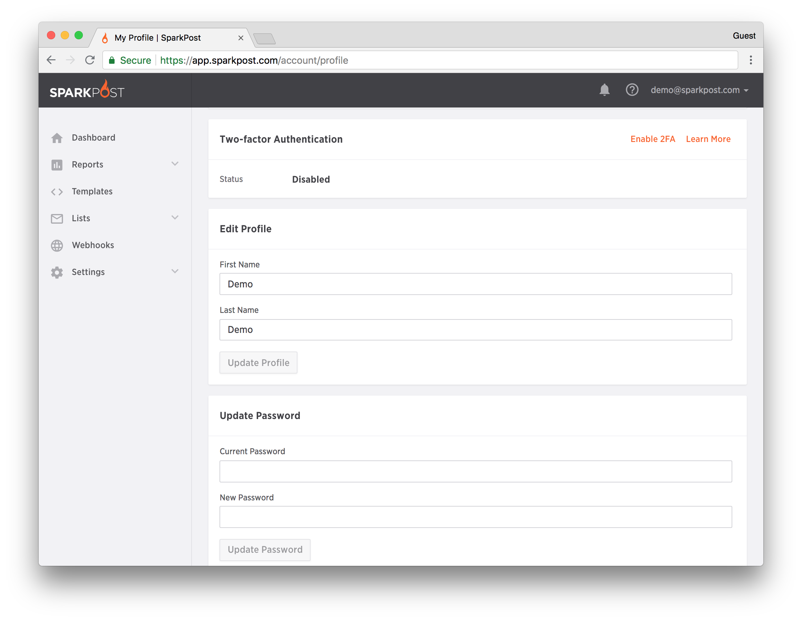
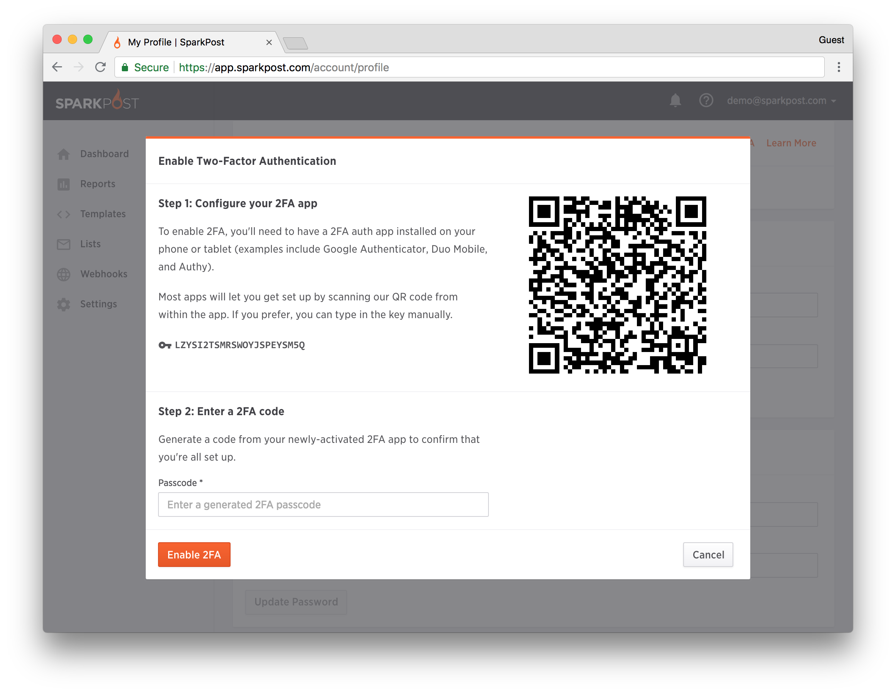
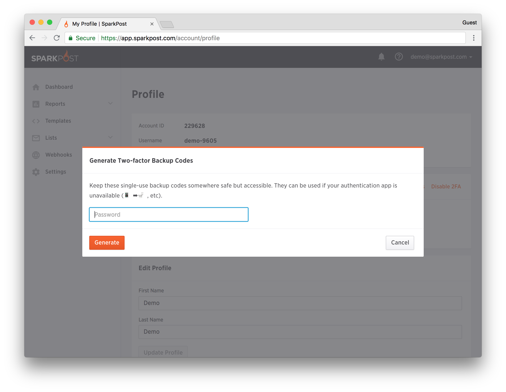
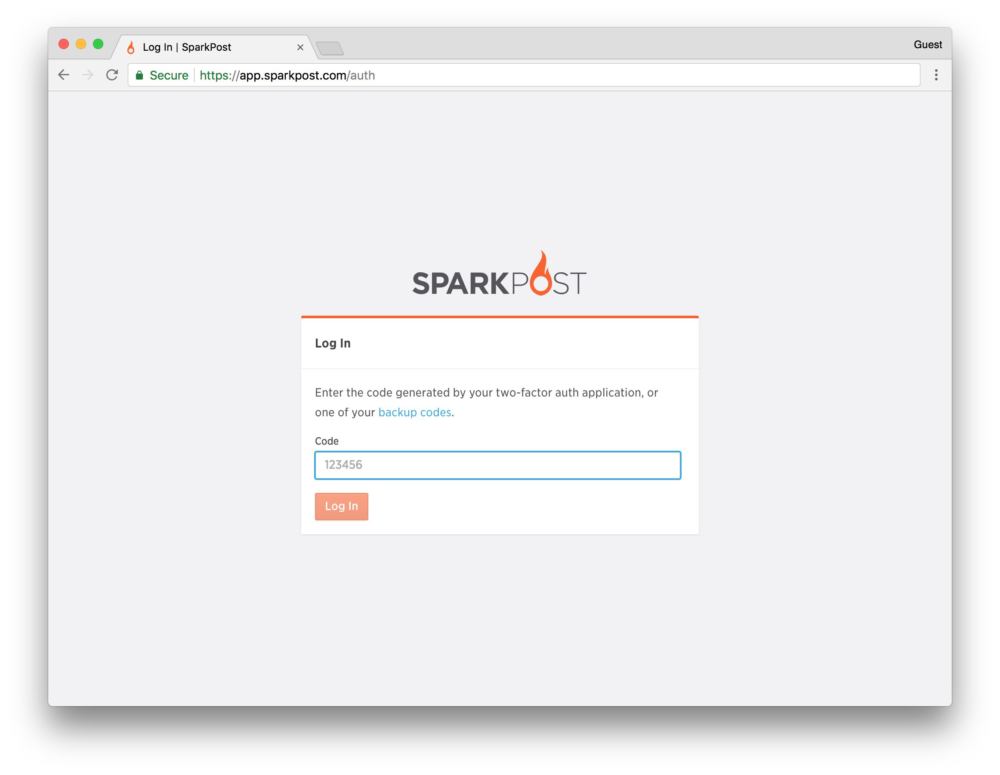

At SparkPost, we take the security of your account very seriously, which is why, for example, we make it easy to apply the [principle of least privilege](https://www.us-cert.gov/bsi/articles/knowledge/principles/least-privilege) when assigning grants to API keys, and even restricting API keys based on source IP address. 

In order to provide you with even greater security, we have introduced Two-Factor Authentication. This allows you to use your account in conjunction with a standard 3rd party Authenticator app such as [Google Authenticator](https://support.google.com/accounts/answer/1066447), [Duo](https://duo.com/product/trusted-users/two-factor-authentication/duo-mobile), or [Authy](https://www.authy.com/app/mobile/) available for iOS, Android, etc.

To enable Two-Factor Authentication, go to the Account menu in the top right and select **Profile**.

Click on **Enable 2FA** and you'll see a screen like this:

Open up your chosen Authenticator App and scan the QR code. If you can’t, or don’t want to scan the QR code, you can also type the 23-character key into your App. 

**NOTE: It is essential that you do store the authentication token somewhere safe! We are unable to reset or remove Two-Factor Authentication from your account should you lose your device.**

Enter a generated 2FA passcode and click on **Enable 2FA** to finish enabling 2 factor authentication.

You may also generate backup codes (after entering your password), which are 8 digits long and can be used instead of entering the code generated by your chosen Authenticator App.

These codes only expire when they are used, and come in handy if your phone disappears. You can also download the codes as a text file, which gives you a simple way to keep track of which ones have been used - add the current date next to the code you’re using.

The next time you log in to your account, after entering your username and password into the login page, you'll see this second level of authentication requested:

Open up your Authenticator App again and look for the SparkPost entry.  You will see a 6-digit number and an expiration timer.  Type that number into the secondary log in page before the timer in your app expires and you'll then be logged in to your account - it's as easy as that! This field also accepts backup codes.

Enabling Two-factor Auth will prevent anyone that does not have access to your Authenticator app or backup codes from logging into your account - even if they somehow get your username and password.

Now you are all set! Two-Factor Authentication is now enabled for your account.
