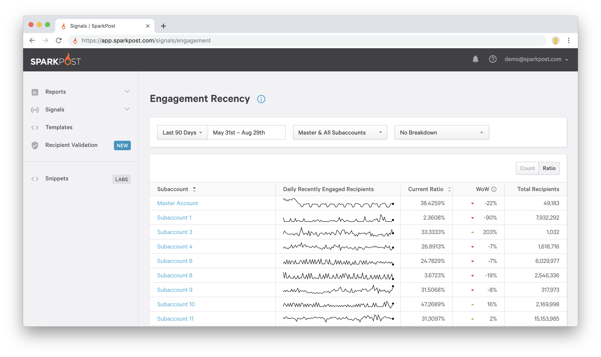
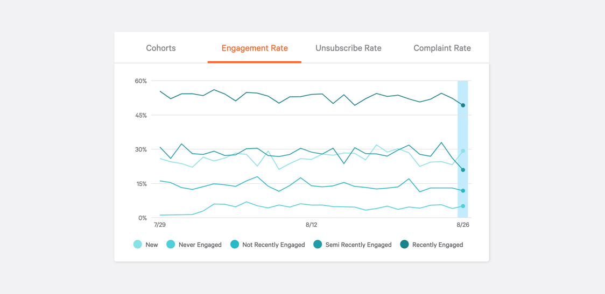

Mailbox providers like Gmail closely monitor recipient engagement to determine inbox placement, making their engagement a critical part of your email health. Engagement Recency summarizes how your recipient engagement changes over time, categorizing your recipients into different cohorts based on the recency of their last interaction.  With this data, Signals provides recommendations to increase your engaged recipients and reduce unsubscribes, bounces, and spam complaints.

_**Note:** For Engagement Recency to function, you must enable at open or click tracking. For best results, enable both._

## Engagement Recency Cohorts

Recipients are divided into the following cohorts:
* **New Recipients** have received their first email from you within the past 7 days and haven't yet engaged with your messages
* **Never Engaged** recipients have received email from you but have never engaged or they last engaged more than one year ago.
* **Not Recently Engaged** recipients have engaged with your email in the past 365 days, but not in the past 90 days.
* **Semi-Recently Engaged** recipients have engaged with your email in the past 90 days, but not in the past 14 days.
* **Recently Engaged** recipients who have engaged with your email in the past 14 days.

## Dashboard

On your Engagement Recency dashboard you'll find the raw counts and ratio of email you've sent to **Recently Engaged** recipients. You should strive to have this cohort be the largest. Use the sorting options to find your best and worst performing facets. To find specific issues, set a date range and filter the results by subaccount, IP pool, sending domain, or campaign.

## Cohort details

When you drill into the details for a specific facet, you'll find 4 different charts outlining the engagement recency cohorts and their interaction with your emails.

The first chart shows the total emails you sent each day, broken up by each cohort.

In the example above, you can see 51.2% of the email that were sent on August 16th were sent to recipients who engaged with this sender's emails in the past 14 days.

With this report, you can see if you are sending to too many disengaged recipients. If the Never Engaged and Not Recently Engaged cohorts make up a majority of the people you send to, you should examine your [list hygiene practices](https://www.sparkpost.com/docs/signals/list-hygiene/).

### Engagement Rate, Unsubscribe Rate, Spam Complaint Rate

You can further dive into each group of recipients to optimize your sending and messaging, as well as find areas for improvement. The three Behavior by Engagement Cohorts reports provide metrics about how each of your different cohorts are engaging with your email, as well as suggestions on how to interpret them. For example, if you see a high unsubscribe or complaint rate from the New cohort, you probably need to work on your list collection and set better expections with new recipients when you collect their emails.

48 hours after emails are sent, the beahvior is processed to give you an accurate view into their patterns.

The behavior charts are:
* Engagement Rate
* Unsubscribe Rate
* Spam Complaint Rate

Each cohorts behavior rate is depicted by a separate line corresponding to the cohort color. Below is the engagement rate broken down by cohorts.

_**Note:** Not all mailbox providers surface spam complaints. While your known complaint rate might be low or zero, there may be complaints that aren't reported. This means that any changes in your complaint rate should be taken seriously._