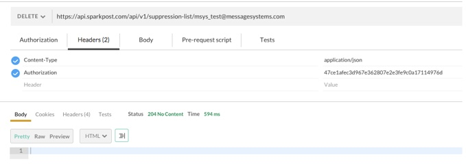

**Introduction**
An suppression list is a list of recipient email addresses that you generally do not want to send to because the email address is invalid OR the recipient has indicated they do not want to receive messages. Addresses on the suppression list are automatically suppressed (not sent to) as an added precaution to protect IP reputation.  It is not intended to take the place of list hygiene activities in the source database. 

The suppression list is *automatically* populated with a recipient’s email address when:

*   The recipient submits a spam complaint
*   The recipient email address is invalid (“hard bounce”)
*   The recipient unsubscribes using an embedded unsubscribe link or the list-unsubscribe feature (if enabled)

The Suppression List API can be used to manage the suppression list – the list can be viewed and edited – recipient addresses can be added or removed.  The suppression list supports two types of messages and an entry indicates whether the recipient will be suppressed from one of the following:

*   Non-transactional messages only (default)
*   Transactional messages
*   Both transactional and non-transactional

The transactional/non-transaction designation allows you to ensure that a recipient’s action on one type of message (say an unsubscribe from a marketing blast) does not prevent the recipient from receiving more sensitive messages like an order confirmation.

*NOTE: “Non_transactional” (always the default) and “transactional” are designations selected by Message Systems to allow you to separate important messages from those that are less relevant -- typically marketing focused.  It may be more meaningful in the context of your business to refer to them as “marketing” (default) and “servicing”.*                                                                                                                                                                                                                                                                                                                                              

[NOTE: In addition to the suppression list, in order to protect IP reputation, Message Systems maintains a proprietary list of recipients addresses that are always suppressed; this list cannot be overridden, viewed or edited.

Additional information on suppression lists can be found within the Message Systems Support documentation: https://support.messagesystems.com/docs/web-rest/v1_mmcapi.html

**Step One:**     
**URL:** https://api.sparkpost.com/api/v1/suppression-list/msys_test@messagesystems.com
**HTTP Method:**         DELETE

**Step Two:**     
An example of a confirmation that a recipient was deleted from an suppression list is provided below:

 **End of "How To" Guide**