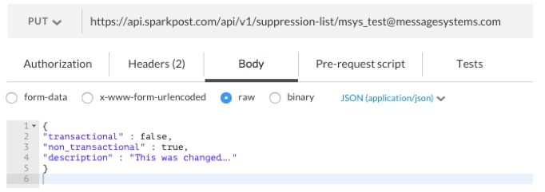
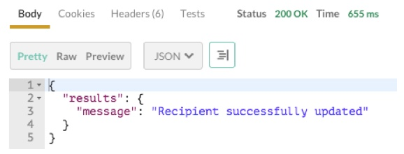

**Introduction**
An suppression list is a list of recipient email addresses that you generally do not want to send to because the email address is invalid OR the recipient has indicated they do not want to receive messages. Addresses on the suppression list are automatically suppressed (not sent to) as an added precaution to protect IP reputation.  It is not intended to take the place of list hygiene activities in the source database. 

The suppressionlist is *automatically* populated with a recipient’s email address when:

*   The recipient submits a spam complaint
*   The recipient email address is invalid (“hard bounce”)
*   The recipient unsubscribes using an embedded unsubscribe link or the list-unsubscribe feature (if enabled)

The Suppression List API can be used to manage the suppression list – the list can be viewed and edited – recipient addresses can be added or removed.  The suppression list supports two types of messages and an entry indicates whether the recipient will be suppressed from one of the following:

*   Non-transactional messages only (default)
*   Transactional messages
*   Both transactional and non-transactional

The transactional/non-transaction designation allows you to ensure that a recipient’s action on one type of message (say an unsubscribe from a marketing blast) does not prevent the recipient from receiving more sensitive messages like an order confirmation.
*NOTE: “Non_transactional” (always the default) and “transactional” are designations selected by Message Systems to allow you to separate messages important messages from those that are less relevant -- typically marketing focused.  It may be more meaningful in the context of your business to refer to them as “marketing” (default) and “servicing”.* 

This tutorial walks through how to modify a recipient on the suppression list.  In some use cases, a recipient may have been added to the suppression list with “transactional” : true, and “non_transactional” : false. The user can edit this through the API instance.

**Step One:**     
Similar to adding a new recipient to the suppression list, you will enter the recipient you want to modify at the end of the URL.  Edit the JSON with the content you would like to update the recipient with.  You can modify transactional, non_transactional, and description here.

**URL:** https://api.sparkpost.com/api/v1/suppression-list/msys_test@messagesystems.com
**HTTP Method:**         PUT

* * *

**Step Two:**     
Click "Send" to update.  The expected result should be:

 **End of "How To" Guide**