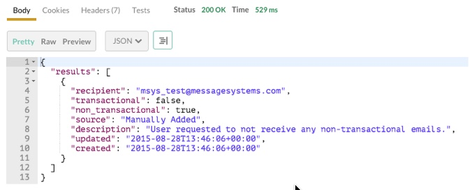

**Introduction**
An suppression list is a list of recipient email addresses that you generally do not want to send to because the email address is invalid OR the recipient has indicated they do not want to receive messages. Addresses on the suppression list are automatically suppressed (not sent to) as an added precaution to protect IP reputation.  It is not intended to take the place of list hygiene activities in the source database. 
The suppression list is *automatically* populated with a recipient’s email address when:

*   The recipient submits a spam complaint
*   The recipient email address is invalid (“hard bounce”)
*   The recipient unsubscribes using an embedded unsubscribe link or the list-unsubscribe feature (if enabled) 

### Pulling the Suppression List via API

This tutorial walks through how to retrieve the entire suppression list via API to review all recipients on the list.  In this example, we will review the suppression list to validate and confirm that the e-mail we added in Part One was successfully added.

**Step One:**     
**URL:** https://api.sparkpost.com/api/v1/suppression-list
**HTTP Method:**         GET 

**Step Two:**     
Click “Send”, and expected results will display the entire list of recipients on the suppression list.  Scroll to find the recipient added to validate and confirm recipient was indeed added. 
Additional information, such as “source”, “updated”, and “created” can be found.

**End of "How To" Guide**