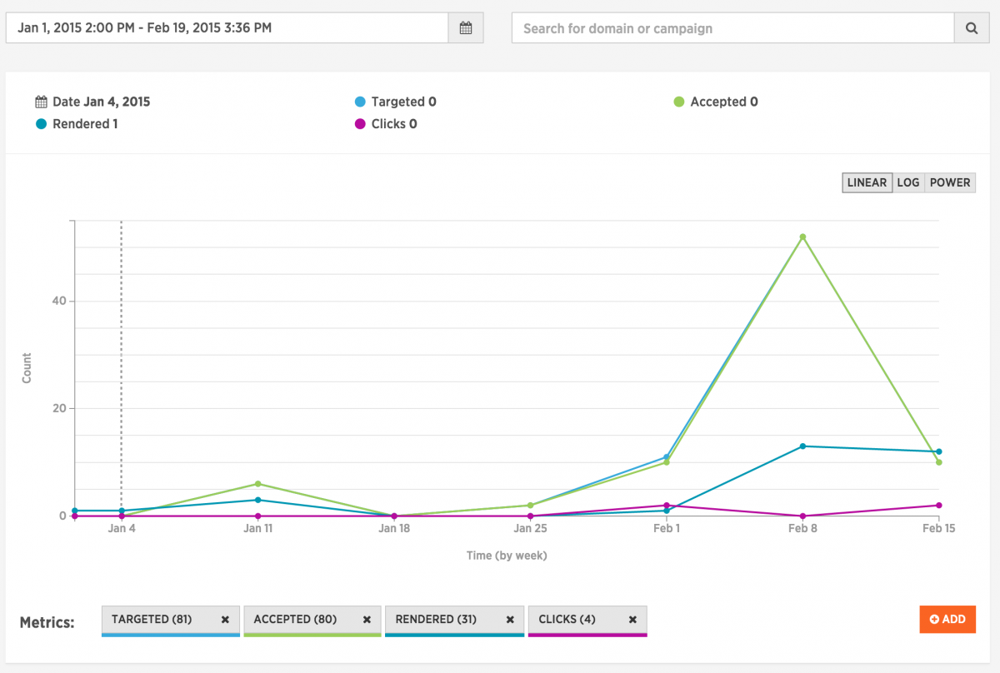
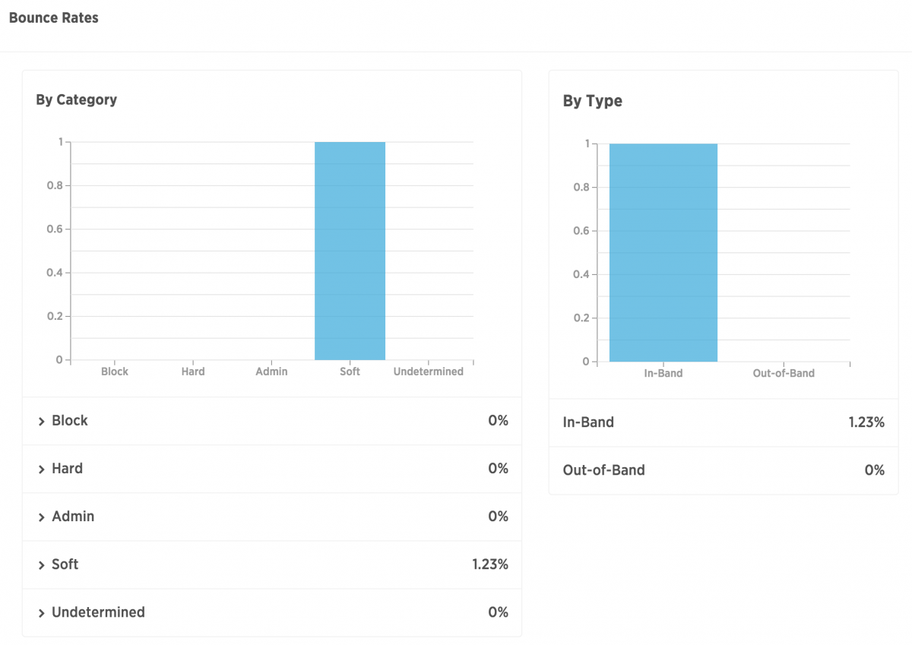
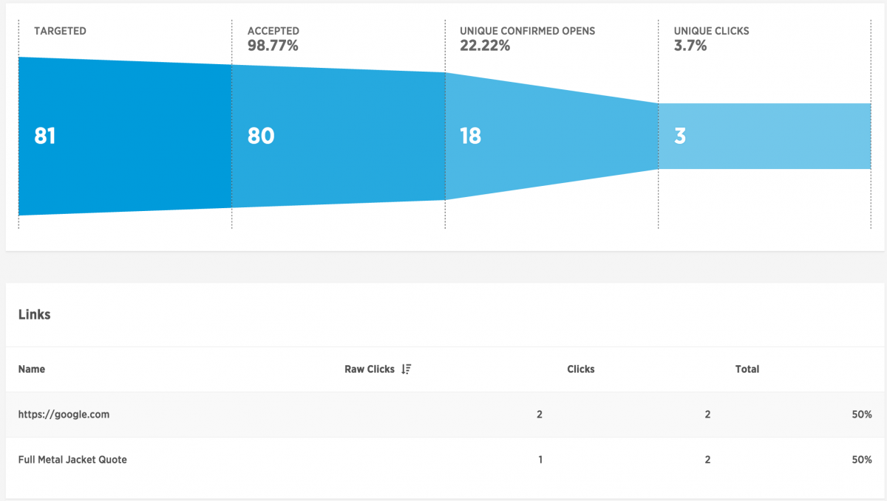

One of the major benefits of SparkPost is the vast amount of reporting metrics we allow you to gather about your email transmissions. We offer over [forty (40) different metrics about the entire lifecycle of your email transmissions](https://support.sparkpost.com/customer/portal/articles/1929969-sparkpost-deliverability-metrics?b_id=7411).

## SparkPost Reporting - The Summary View

1. Login to SparkPost
1. Navigate to [Reports](https://app.sparkpost.com/reports)
1. The default reporting view is the [Summary](https://app.sparkpost.com/reports/summary) view, as seen below. The Summary view provides you the ability to select from a variety of metrics, adjust reporting date ranges, and to filter by campaign or domain (the recipient's domain...not your sending domains).
    
1. If you want to adjust the date ranges you can click the calendar icon next to the date listings at the top to see the date range selector. SparkPost provides you with the ability to quickly view: the past hour, past day, past week, and past month, and thre months with the press of a button. Of course, we also provide you the ability to choose your own custom range to filter the report data.
    - Click the calendar to view the date range selector tool
    
    - Here is what the date range selector tool in SparkPost looks like:

    
1. You are allowed to select up to five (5) metrics for viewing in the Summary (from the list of metrics listed at the top of this page).
1. You can also use the domain/campaign filter at to only display summary report metric data for a subset of your SparkPost transmission data.
    
1. The domain/campaign filtered tabular report data is viewable at the bottom of the screen
    

## SparkPost Reporting - The Bounces View

Bounced reporting in SparkPost provides you with the same date and domain filtering tools as the summary, but offer three (3) new data visualizations. ***The rejected, delayed, and accepted Report views all are similar to the Bounce Report (so we won't elaborate upon them any further).***

1.  Bucketed Aggregates for: Targeted, Accepted, Bounces, and Bounce Rate
    
2.  Bounce Rates by Type and Category
    
3.  Bounced Messages, which tells you some information about which messages have bounced
    

## SparkPost Reporting - Enagement View

The Engagement report provides an interesting funnel visualization which helps you understand the performance of your transmissions. It also contains a "Links" set of tabular data which shows you which links in your email have been clicked most often by your recipients for the filtered time range.
